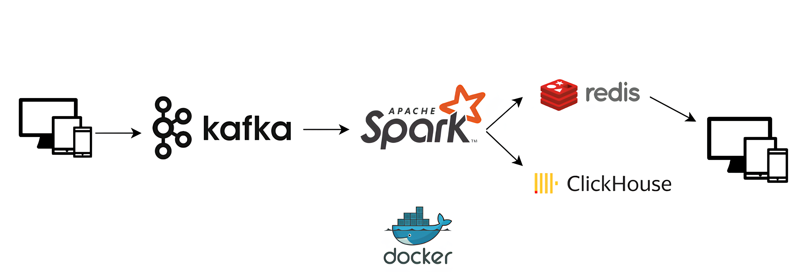

# Реализация потоковой обработки данных с использованием Kafka и Spark

## Описание проекта
Этот проект реализует потоковую обработку данных с использованием Apache Kafka, Apache Spark, Redis и ClickHouse, работая в среде Docker. Данные отправляются в Kafka, затем обрабатываются в Spark ML, а результаты записываются в ClickHouse и Redis.



## Состав проекта
- **Kafka** - брокер сообщений для передачи данных между компонентами.
- **Spark** - обработка данных с использованием машинного обучения (ML).
- **ClickHouse** - хранилище для хранения предсказаний модели.
- **Redis** - кэширование результатов предсказаний.
- **Docker** - контейнеризация всех сервисов для удобного развертывания.

## Запуск проекта
### 1. Запуск инфраструктуры
Развернем все сервисы с помощью `docker-compose`:
```sh
docker-compose up -d
```

### 2. Запуск Spark Streaming Job
После запуска инфраструктуры необходимо запустить обработку потока данных в Spark:
```sh
docker exec -it spark-master bash
spark-submit \
  --master spark://spark-master:7077 \
  --deploy-mode client \
  /opt/bitnami/spark/streaming_pipeline.py
```

### 3. Запуск потока данных в Kafka
Скрипт отправляет тестовые данные в Kafka:
```sh
python ./scripts/send_data_to_kafka.py
```

### 4. Проверка результата в ClickHouse
Выполняем SQL-запрос для проверки предсказаний модели:
```sh
docker exec -it clickhouse clickhouse-client
select * from personal_offer limit 1 format Vertical;
```

### 5. Проверка результата в Redis
Запрашиваем данные по конкретному `user_id`:
```sh
docker exec -it redis redis-cli
get 1
```

## Компоненты проекта

### 1. Kafka и потоковая передача данных
**Конфигурация Kafka** осуществляется через `docker-compose.yml`. Kafka принимает сообщения от отправителя (`send_data_to_kafka.py`).

**Инициализация Kafka** выполняется с помощью `setup.sh`, который создает топик `streaming-user-registration`:
```sh
kafka-topics --create --topic streaming-user-registration --partitions 3 --replication-factor 1 --bootstrap-server kafka-cluster:9092
```

### 2. Spark и обработка данных
Скрипт `streaming_pipeline.py` выполняет следующее:
- Подключается к Kafka и считывает потоковые данные.
- Обрабатывает данные с помощью ML-модели.
- Сохраняет результаты в ClickHouse и Redis.

**Путь к модели:**
Модель машинного обучения хранится в каталоге:
```
docker_data/jupyter_notebooks/enhanced_tariff_model
```

### 3. ClickHouse и хранение данных
ClickHouse используется как хранилище для результатов предсказаний. Данные загружаются в таблицу `personal_offer`.

### 4. Redis и кэширование результатов
Redis используется для быстрого доступа к предсказаниям, например:
```sh
get 1
```

## Структура проекта
```
.
├── docker-compose.yml          # Конфигурация всех сервисов
├── Dockerfile.spark            # Конфигурация образа Spark
├── scripts
│   ├── send_data_to_kafka.py   # Скрипт отправки данных в Kafka
│   ├── setup.sh                # Скрипт инициализации Kafka
├── streaming_pipeline.py       # Spark Streaming обработка
├── model-development.ipynb     # Обучение ML-модели
├── docker_data
│   ├── jupyter_notebooks
│   │   ├── enhanced_tariff_model # Папка с моделью машинного обучения
```

## Требования
- **Docker**
- **Python 3.x**
- Библиотеки: `pyspark`, `clickhouse-driver`, `redis`, `requests`, `tqdm`

## Завершение работы
Остановка всех контейнеров:
```sh
docker-compose down
```